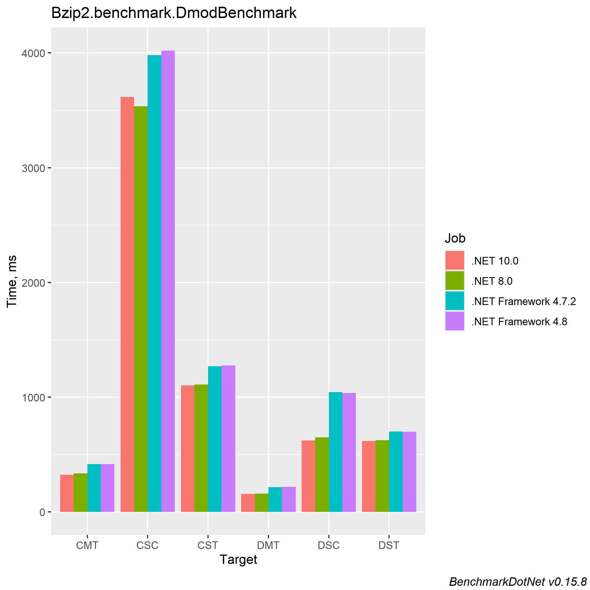
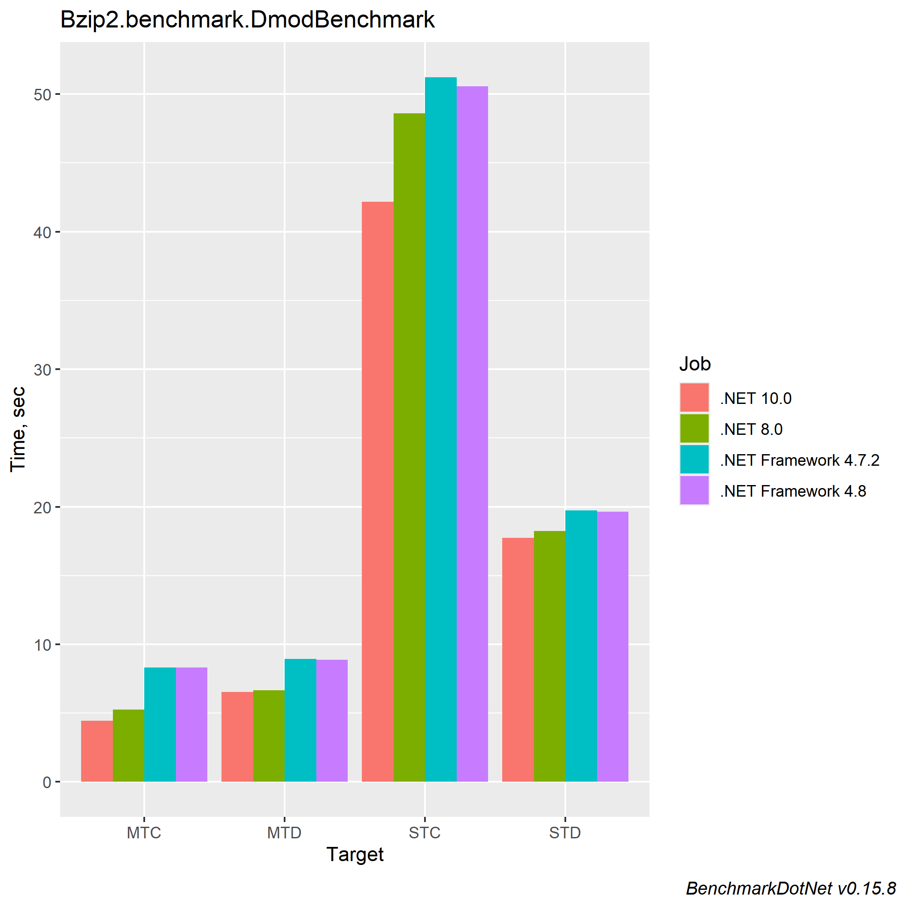

# bzip2.net
A pure C# implementation of the bzip2 compressor with parallel compression and decompression support.

Originally ported by Jaime Olivares: https://github.com/jaime-olivares/bzip2

Based on the Java implementation by Matthew Francis: https://github.com/MateuszBartosiewicz/bzip2

# Notes

The compression algorithm doesn't generate randomized blocks, which is already a deprecated option and may not be decoded by modern bzip2 libraries. Other popular .net compression libraries do generate randomized blocks.

Nuget package is currently not available for this modification nor do I have any plans to publish it there.

_DISCLAIMER (Jaime Olivares)_: Unfortunately, this library has a well-known bug coming from the original implementation, as reported [here](https://github.com/MateuszBartosiewicz/bzip2/issues/1)

_DISCLAIMER NOTE_:I have not yet encountered this well-known bug mentioned above...

# Benchmarks

I used [BenchmarkDotNet](https://benchmarkdotnet.org/) for testing how well the bzip2 implementation performs.

I'm mostly just using DMODs (Mods for an old game called Dink Smallwood that use bz2 compression) as test files for my benchmarks. 

### Host info

```
BenchmarkDotNet v0.15.8, Windows 10 (10.0.19045.6456/22H2/2022Update)
13th Gen Intel Core i7-13700K 3.40GHz, 1 CPU, 24 logical and 16 physical cores
  [Host]               : .NET Framework 4.8.1 (4.8.9310.0), X64 RyuJIT VectorSize=256
  .NET 10.0            : .NET 10.0.0 (10.0.0, 10.0.25.52411), X64 RyuJIT x86-64-v3
  .NET 8.0             : .NET 8.0.22 (8.0.22, 8.0.2225.52707), X64 RyuJIT x86-64-v3
  .NET Framework 4.7.2 : .NET Framework 4.8.1 (4.8.9310.0), X64 RyuJIT VectorSize=256
  .NET Framework 4.8   : .NET Framework 4.8.1 (4.8.9310.0), X64 RyuJIT VectorSize=256
```

## DMOD - Friends Beyond 3

Source file is `Version v2.01` of this DMOD: https://www.dinknetwork.com/file/friends_beyond_3_legend_of_tenjin/

### Abbreviations

* CST = Single Thread Compression
* CMT = Multi Thread Compression
* DST = Single Thread Decompression
* DMT = Multi Thread Decompression
* CSC = Compression using [SharpCompress](https://github.com/adamhathcock/sharpcompress/) BZip2 implementation
* DSC = Decompression using [SharpCompress](https://github.com/adamhathcock/sharpcompress/) BZip2 implementation

| Method | Job                  | Runtime              | Mean       | Error    | StdDev   | Ratio | RatioSD |
|------- |--------------------- |--------------------- |-----------:|---------:|---------:|------:|--------:|
| CMT    | .NET 10.0            | .NET 10.0            |   325.2 ms |  6.32 ms |  6.21 ms |  0.78 |    0.02 |
| CMT    | .NET 8.0             | .NET 8.0             |   337.2 ms |  6.59 ms |  6.76 ms |  0.81 |    0.02 |
| CMT    | .NET Framework 4.7.2 | .NET Framework 4.7.2 |   417.8 ms |  8.11 ms | 10.83 ms |  1.00 |    0.03 |
| CMT    | .NET Framework 4.8   | .NET Framework 4.8   |   416.9 ms |  7.90 ms |  8.78 ms |  1.00 |    0.03 |
|        |                      |                      |            |          |          |       |         |
| CST    | .NET 10.0            | .NET 10.0            | 1,103.6 ms |  3.06 ms |  2.71 ms |  0.86 |    0.00 |
| CST    | .NET 8.0             | .NET 8.0             | 1,110.5 ms |  5.08 ms |  4.75 ms |  0.87 |    0.01 |
| CST    | .NET Framework 4.7.2 | .NET Framework 4.7.2 | 1,271.0 ms |  6.81 ms |  6.37 ms |  1.00 |    0.01 |
| CST    | .NET Framework 4.8   | .NET Framework 4.8   | 1,276.6 ms |  7.38 ms |  6.55 ms |  1.00 |    0.01 |
|        |                      |                      |            |          |          |       |         |
| CSC    | .NET 10.0            | .NET 10.0            | 3,616.1 ms | 31.84 ms | 28.23 ms |  0.90 |    0.01 |
| CSC    | .NET 8.0             | .NET 8.0             | 3,536.7 ms | 28.01 ms | 26.20 ms |  0.88 |    0.01 |
| CSC    | .NET Framework 4.7.2 | .NET Framework 4.7.2 | 3,980.5 ms | 22.39 ms | 20.95 ms |  0.99 |    0.01 |
| CSC    | .NET Framework 4.8   | .NET Framework 4.8   | 4,020.3 ms | 32.75 ms | 30.63 ms |  1.00 |    0.01 |
|        |                      |                      |            |          |          |       |         |
| DMT    | .NET 10.0            | .NET 10.0            |   158.8 ms |  3.11 ms |  4.65 ms |  0.73 |    0.03 |
| DMT    | .NET 8.0             | .NET 8.0             |   159.4 ms |  3.16 ms |  4.63 ms |  0.73 |    0.03 |
| DMT    | .NET Framework 4.7.2 | .NET Framework 4.7.2 |   217.6 ms |  4.34 ms |  5.00 ms |  1.00 |    0.04 |
| DMT    | .NET Framework 4.8   | .NET Framework 4.8   |   218.5 ms |  4.25 ms |  6.22 ms |  1.00 |    0.04 |
|        |                      |                      |            |          |          |       |         |
| DST    | .NET 10.0            | .NET 10.0            |   617.4 ms | 11.77 ms | 10.44 ms |  0.88 |    0.02 |
| DST    | .NET 8.0             | .NET 8.0             |   626.4 ms |  5.23 ms |  4.63 ms |  0.90 |    0.01 |
| DST    | .NET Framework 4.7.2 | .NET Framework 4.7.2 |   700.6 ms |  7.01 ms |  6.56 ms |  1.00 |    0.01 |
| DST    | .NET Framework 4.8   | .NET Framework 4.8   |   699.1 ms |  4.69 ms |  3.92 ms |  1.00 |    0.01 |
|        |                      |                      |            |          |          |       |         |
| DSC    | .NET 10.0            | .NET 10.0            |   622.6 ms | 11.53 ms | 11.84 ms |  0.60 |    0.01 |
| DSC    | .NET 8.0             | .NET 8.0             |   651.1 ms |  8.20 ms |  7.67 ms |  0.63 |    0.01 |
| DSC    | .NET Framework 4.7.2 | .NET Framework 4.7.2 | 1,044.9 ms | 16.67 ms | 15.60 ms |  1.01 |    0.02 |
| DSC    | .NET Framework 4.8   | .NET Framework 4.8   | 1,036.7 ms | 17.73 ms | 16.59 ms |  1.00 |    0.02 |




## DMOD - Necromancer

Source file is `Version Demo v1.02` of this DMOD: https://www.dinknetwork.com/file/necromancer/

### Abbreviations

* STC = Single Thread Compression
* MTC = Multi Thread Compression
* STD = Single Thread Decompression
* MTD = Multi Thread Decompression

| Method | Job                  | Runtime              | Mean     | Error    | StdDev   | Ratio | RatioSD |
|------- |--------------------- |--------------------- |---------:|---------:|---------:|------:|--------:|
| STC    | .NET 10.0            | .NET 10.0            | 42.168 s | 0.2508 s | 0.2346 s |  0.83 |    0.01 |
| STC    | .NET 8.0             | .NET 8.0             | 48.595 s | 0.0918 s | 0.0858 s |  0.96 |    0.00 |
| STC    | .NET Framework 4.7.2 | .NET Framework 4.7.2 | 51.222 s | 0.4083 s | 0.6932 s |  1.01 |    0.01 |
| STC    | .NET Framework 4.8   | .NET Framework 4.8   | 50.564 s | 0.1539 s | 0.1440 s |  1.00 |    0.00 |
|        |                      |                      |          |          |          |       |         |
| MTC    | .NET 10.0            | .NET 10.0            |  4.446 s | 0.0348 s | 0.0309 s |  0.54 |    0.01 |
| MTC    | .NET 8.0             | .NET 8.0             |  5.258 s | 0.0345 s | 0.0323 s |  0.63 |    0.01 |
| MTC    | .NET Framework 4.7.2 | .NET Framework 4.7.2 |  8.312 s | 0.1387 s | 0.1297 s |  1.00 |    0.02 |
| MTC    | .NET Framework 4.8   | .NET Framework 4.8   |  8.304 s | 0.1477 s | 0.1233 s |  1.00 |    0.02 |
|        |                      |                      |          |          |          |       |         |
| STD    | .NET 10.0            | .NET 10.0            | 17.738 s | 0.0814 s | 0.0680 s |  0.90 |    0.01 |
| STD    | .NET 8.0             | .NET 8.0             | 18.242 s | 0.1302 s | 0.1218 s |  0.93 |    0.01 |
| STD    | .NET Framework 4.7.2 | .NET Framework 4.7.2 | 19.734 s | 0.0677 s | 0.0633 s |  1.01 |    0.01 |
| STD    | .NET Framework 4.8   | .NET Framework 4.8   | 19.630 s | 0.1430 s | 0.1338 s |  1.00 |    0.01 |
|        |                      |                      |          |          |          |       |         |
| MTD    | .NET 10.0            | .NET 10.0            |  6.528 s | 0.0247 s | 0.0231 s |  0.74 |    0.00 |
| MTD    | .NET 8.0             | .NET 8.0             |  6.662 s | 0.0326 s | 0.0305 s |  0.75 |    0.00 |
| MTD    | .NET Framework 4.7.2 | .NET Framework 4.7.2 |  8.950 s | 0.0478 s | 0.0447 s |  1.01 |    0.01 |
| MTD    | .NET Framework 4.8   | .NET Framework 4.8   |  8.882 s | 0.0197 s | 0.0184 s |  1.00 |    0.00 |

